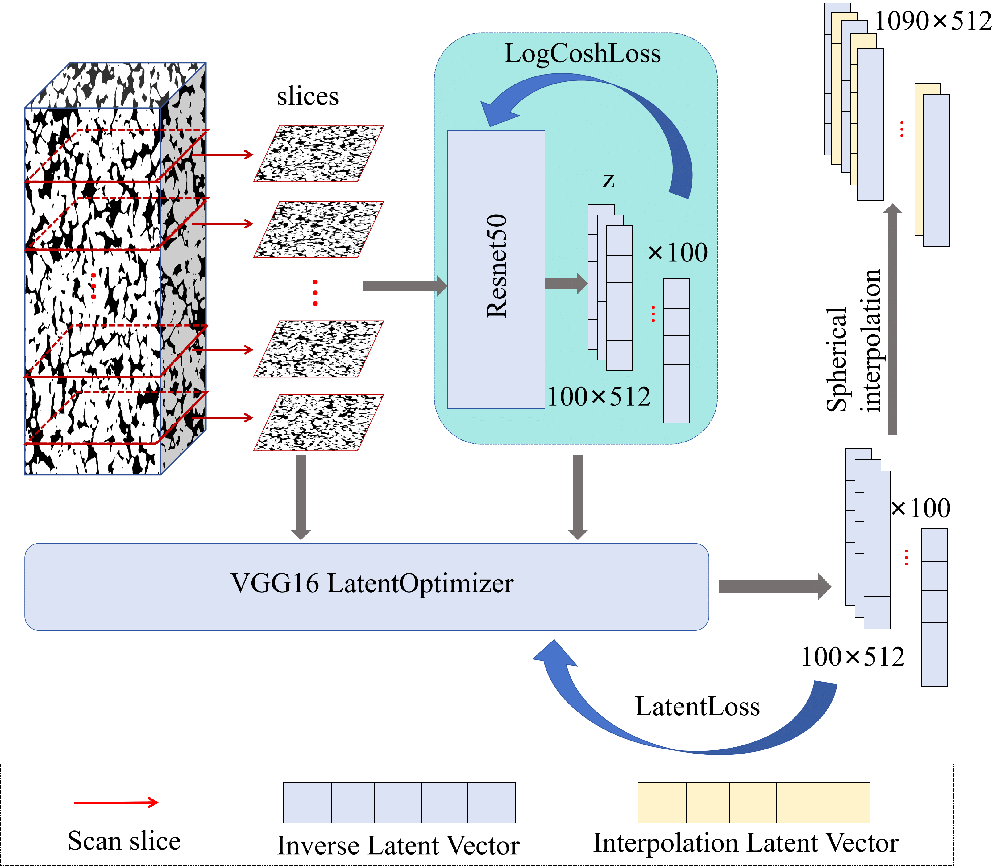

# ADA-PGGAN

This is the official repository for "For Any Two Arbitrary Slices from One Digital Rock , Its Twins Can be Fast Stably Reconstructed :A Novel Integrated Model of RVION with ADA-PGGAN". Please cite this work if you find this repository useful for your project.


Amounts of digital rock samples are crucial for studying pore properties. However, it is currently challenging due to equipment limitations or cost considerations. To address this issue, we propose sorts of reconstruction solutions under Data-Scarce Scenarios based on latent inversion predict from proposed generative model. Firstly, A novel featured distribution learning model was proposed  though O-ResNet50 network training for prepared inversion. During inversion, the    latent vectors predict from mentioned learning model is prepared to interpolate into latent space of given images. To stably produce high-quality images, Adaptive Data Augmentation Progressive Growing Generative Adversarial Network (ADA-PGGAN) is proposed, which includes a mechanism to supervise discriminator's overfitting and automatically adjust levels of data augmentation. Subsequently, interpolated latent vectors are input into the generator to progressively increase image resolution and reconstruct large-scale 3D digital rocks.Finally, evaluations using various metrics were conducted in both 2D and 3D on our results. The Sliced Wasserstein Distance (SWD) was used to assess our proposed data augmentation operation. The majority of SWD values remained below 0.01, with further decreases as resolution increased. Furthermore, generated images accurately exhibited core characteristics.We also evaluated our results in 3D with corresponding metrics, structural properties to indicate consistency with given samples.





## Usage

ADA-PGGAN generates training for the model, running train.py in generate.

```bash
python train.py PGAN -c config_celebaHQ.json --restart -n celebaHQ --np_vis
```
